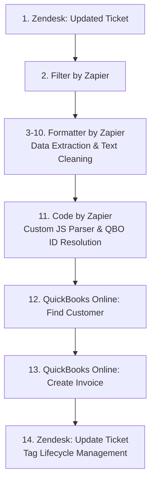

# Zendesk to QuickBooks Online Invoice Automation Parser

> **Status:** Production / Deployed

## Overview
An automated support-to-billing pipeline engineered to bridge the operational gap between frontline Customer Support (Zendesk) and Finance/Accounting (QuickBooks Online). It eliminates manual invoice creation by automatically parsing ticket payloads, mapping product/service shorthand directly to QuickBooks Internal Product IDs, and drafting invoices in QBO.

## The Problem
Manual invoice requests created operational friction between Support and Accounting. Hand-entering line items, unit prices, service dates, and ledger classifications led to data entry delays, higher risk of human error, duplicate processing, and heavy administrative overhead.

## The Solution & Workflow Architecture
1. **Trigger:** Support agents select a standardized macro in Zendesk containing structured billing parameters (e.g., shorthand product abbreviations) and apply an initial trigger tag (`pending_invoice`).
2. **Data Extraction (Zapier):** Zapier captures the ticket update webhook payload from Zendesk.
3. **Parsing & ID Resolution Engine (Custom JS):** A custom Node.js script parses raw note text and translates shorthand Zendesk abbreviations directly into QuickBooks Online **Internal Product/Item IDs**, bypassing prone-to-error SKU strings to guarantee 100% database mapping accuracy.
4. **Action (QuickBooks Online):** Zapier maps the resolved Internal Product IDs, calculated prices, and departmental class IDs directly into QBO to create a pre-populated draft invoice.
5. **State Management & Deduplication (Zendesk API):** Zapier executes an API call back to Zendesk to remove `pending_invoice` and add `invoice_created`, locking the ticket state and preventing duplicate invoice generation loops.
6. **Review:** Finance performs a quick 1-click review and approves the draft invoice for the client.

## 🔄 System Workflow Architecture



## Key Operational Impact
* **100% Reliable Item Matching:** Resolving ticket shorthand directly to QBO Internal Product IDs eliminates SKU mismatch errors and catalog syncing bugs.
* **Zero Duplication Risk:** Dynamic tag lifecycle management guarantees idempotent execution (tickets cannot be double-invoiced).
* **Accounting Overhead:** Reduces manual data entry time by ~90% and slashes turnaround times from days to seconds.
* **Accuracy:** Automatically handles multi-line orders, dynamic service date mapping, and departmental class tracking with built-in error handling for unmapped abbreviations.

## Tech Stack
* **Language:** JavaScript (Node.js ES6+)
* **Integration Platform:** Zapier
* **Platforms & APIs:** Zendesk Webhooks / API, QuickBooks Online API

---

## 💡 Input vs. Output Example

**Zendesk Internal Note Payload (Input):**
```text
Items: 2 x PROD-A, 1 x SERV-ALPHA
Service Dates: 2026-08-15, 2026-08-
```
**Parsed Output (Mapped to QBO API):**
```
{
  "qboProductIds": ["5000000101", "5000000201"],
  "quantities": [2, 1],
  "prices": [50.00, 150.00],
  "amounts": [100.00, 150.00],
  "descriptions": ["PROD-A", "SERV-ALPHA"],
  "categories": ["CAT-DIGITAL_SELF_SERVE", "CAT-LOCATION_ALPHA"],
  "serviceDates": ["2026-08-15", "2026-08-16"],
  "skipped": "none"
}
```

